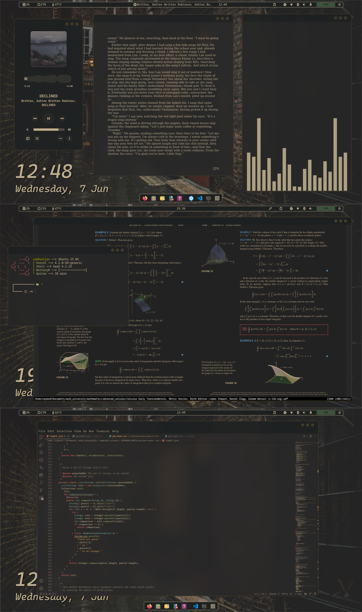

# Raymond's Dotfiles

***Please note I am not doing the below yet, I am still creating the dotfiles. It is a work in progress.***

## Quick Installation Instructions
I have put a README.md in each of the directories. 
The README.md contains:
- An important explanation of where the specific configuration file should be 
located on your system
- A brief explanation of what the directory contains.
- A Screenshot of how the finished config looks

## New to the community?
Possibly provide some pointers...
