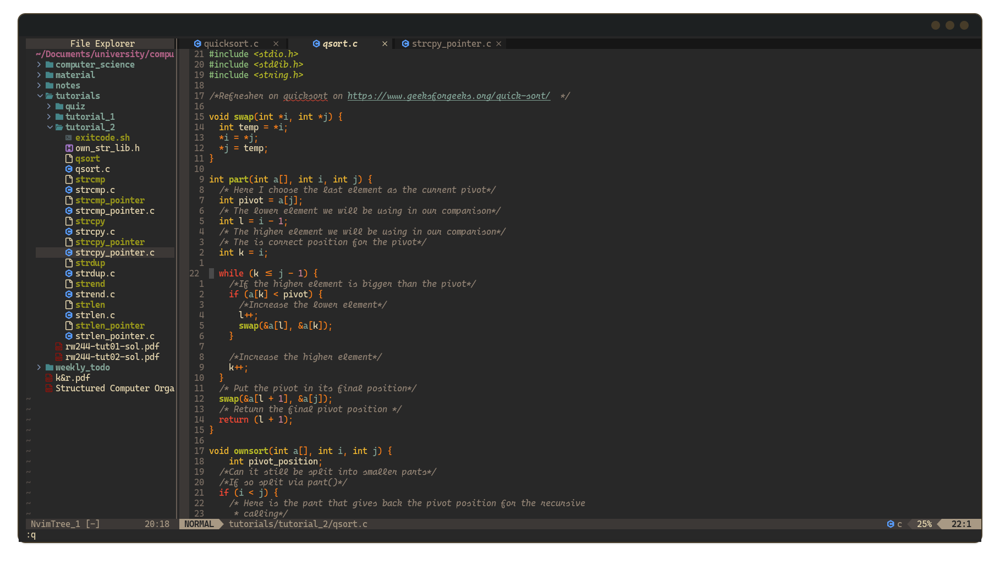
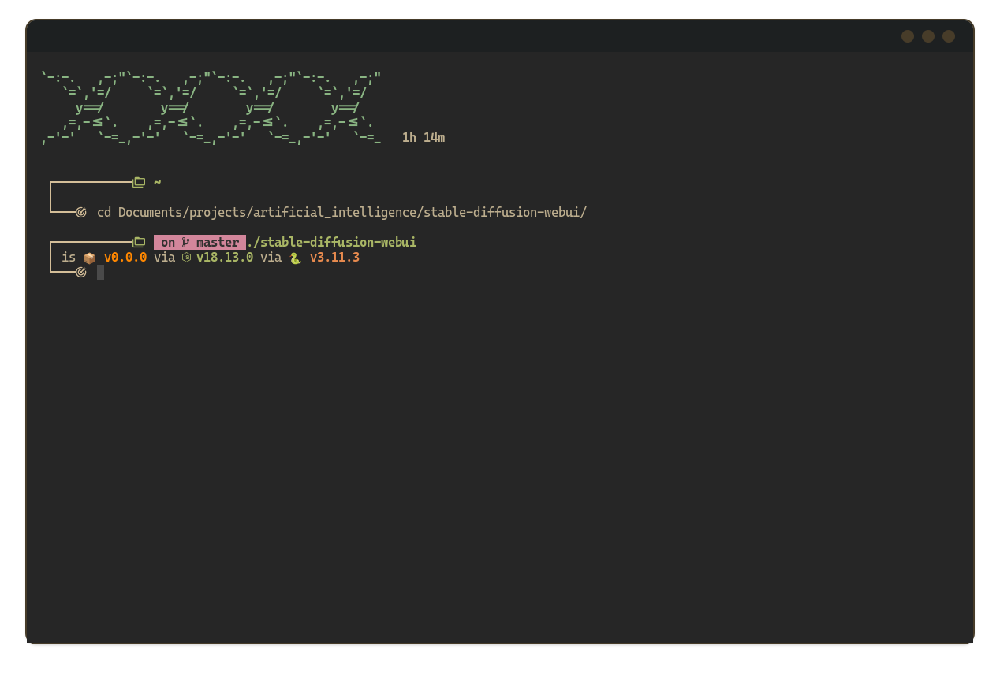

# Raymond's Dot Files

***Please note I am not doing the below yet, I am still creating the dotfiles. It is a work in progress.***

I want to include the following type table in my README.md to create a good overall of everything.
Example:

|nvim_example|terminal|music_player|
|--|--|--|
||||
|something_else|another_thing|and_another_thing|
||||

## Quick Installation Instructions
I have put a README.md in each of the directories. 
The README.md contains:
- An important explanation of where the specific configuration file should be 
located on your system
- A brief explanation of what the directory contains.
- A Screenshot of how the finished config looks

## New to the community?
Possibly provide some pointers...
